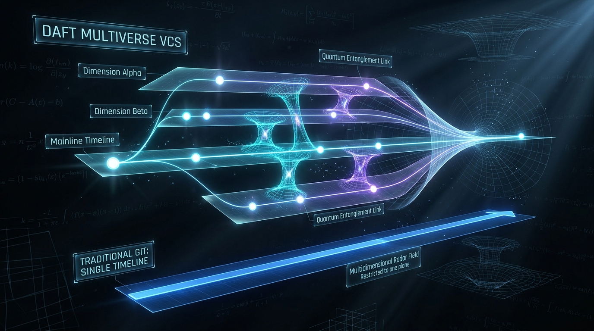

# Darf (`drf`) — The Multiverse Version Control System

[](LICENSE)
[](https://www.rust-lang.org/)
[](#)
[](#)
[](#)
[](#)

> *"In classical physics, you can only observe one timeline at a time. In Darf, you live in all of them at once."*

---



---

## ⚡ The Architectural Shift: Why Darf?

**Git was engineered in 2005 for single-threaded human developers.**  
**Darf (`drf`) was architected in 2026 for parallel, multi-agent AI and human swarms.**

Modern software engineering faces a concurrency crisis at the version control layer:
1. **The Single-Universe Bottleneck**: Git limits a working repository to a single checked-out `HEAD` and working directory. Concurrently running multiple AI agents or collaborating developers requires brittle `git worktree` setups or multi-gigabyte repository clones that exhaust disk and memory.
2. **Blind Collision**: Agents editing files concurrently have zero awareness of each other until a final `git merge` or rebase triggers catastrophic conflict resolution.
3. **Reactive Merge Friction**: Traditional VCS operates reactively. Conflicts are detected *after* code changes are completed, requiring manual 3-way triage.

### What Darf (`drf`) Delivers:
- 🌌 **Parallel Dimensions**: Spawn 10, 20, or 100 isolated, Copy-on-Write (CoW) workspaces in **0.06 seconds** sharing a lock-free, content-addressable storage (CAS) engine with zero extra disk footprint.
- 📡 **Cross-Dimensional Radar**: Real-time sensing of file access and write operations across all concurrent dimensions.
- 🔮 **Predictive Quantum Foresight (`drf foresee`)**: Line-level simulation of 3-way merges in memory *before* branch integration occurs.
- 🔒 **Territory Leasing & Boundary Fences**: Advisory path leases (`drf claim`) and hard exclusionary barriers (`drf fence`) to eliminate agent collision.
- 🔗 **Quantum Entanglement (`drf entangle`)**: Bi-directional live auto-propagation of file updates between selected dimensions.
- ⏰ **Cronos Autonomous Daemon**: Background continuous 3-way tree convergence engine.
- 🌊 **Wavefunction Collapse (`drf collapse`)**: Synthesize dozens of parallel branches into a single unified mainline reality in one command.
- 🖥️ **DarftMultiverse Self-Hosted Web Platform**: Gitea-grade web interface (`drf ui`) featuring live file tree browsing, syntax-highlighted blob viewing, Myers diff inspections, interactive Spacetime DAG visualization, and an embedded terminal console.
- 🪐 **Decentralized Remote Sync (`DaftUniverse`)**: Native remote push/pull protocol without dependence on third-party git hosts.

---

## 📖 Backstory & Philosophy

### The Swarm Concurrency Breakdown
In 2026, autonomous AI engineering agents transitioned from novelty to necessity. Engineering teams attempted to orchestrate teams of specialized AI agents working concurrently on single repositories:
- **Agent Alpha**: Database engine & migration rewrite.
- **Agent Beta**: HTTP REST & WebSocket API layer.
- **Agent Gamma**: Web frontend UI components.
- **Agent Delta**: Comprehensive integration test suites.
- **Agent Epsilon**: Memory profiling and algorithmic optimizations.

The moment multiple agents executed in parallel, **Git collapsed**:
- Agents switching branches trampled each other's unstaged files.
- Multiple local clones duplicated tens of thousands of build artifacts, causing severe disk thrashing and kernel memory exhaustion.
- At the end of every sprint, merging branches caused days of human triage.

Software synthesis had accelerated to light speed, but version control was trapped on a single thread. **Darf was built to give software development infinite concurrent bandwidth.**

### Sincere Tribute to Linus Torvalds
Darf stands on the shoulders of Linus Torvalds. In 2005, Linus revolutionized software engineering by creating Git in two weeks. His insights—content-addressable object storage, cryptographically verified acyclic commit graphs, and immutable blob snapshots—remain foundational.

We named this system **Darf (`drf`)** in Linus's proud tradition of self-deprecating names. "Darf" reflects our irreverence toward the sacred dogma of single-branch version control. Darf retains Linus's CAS principles while unlocking the **Multiverse Dimension**.

---

## 🔬 Deep Technical Architecture

```
                               ┌───────────────────────────┐
                               │   DarftMultiverse (GUI)   │ (Web Platform on :3333)
                               └─────────────┬─────────────┘
                                             │
                               ┌─────────────▼─────────────┐
                               │   daft-cli (`drf` binary) │
                               └─────────────┬─────────────┘
                ┌────────────────┬───────────┴───────────┬────────────────┐
                │                │                       │                │
                ▼                ▼                       ▼                ▼
       ┌─────────────────┐ ┌───────────┐         ┌──────────────┐ ┌───────────────┐
       │ daft-convergence│ │ daft-sync │         │  daft-agent  │ │ daft-awareness│
       └────────┬────────┘ └─────┬─────┘         └──────┬───────┘ └───────┬───────┘
                │                │                      │                 │
                └───────────┬────┴──────────────────────┘                 │
                            ▼                                             │
                  ┌──────────────────┐                                    │
                  │  daft-dimension  │◄───────────────────────────────────┘
                  └─────────┬────────┘
                            ▼
                  ┌──────────────────┐
                  │    daft-core     │ (CAS, Index, Myers Diff, Refs, Engine)
                  └──────────────────┘
```

### 1. Content-Addressable Storage (CAS) Engine
- **Hashing**: Cryptographic SHA-256 producing 32-byte direct digest identifiers (`ObjectId = [u8; 32]`, formatted as 64-character hex strings).
- **Object Framing**: Canonical git-compatible envelope framing:
  $$\text{Payload} = \langle\text{type}\rangle + \texttt{" "} + \langle\text{length}\rangle + \texttt{"\\0"} + \langle\text{data}\rangle$$
- **Compression**: Deflate/zlib streaming compression (level 6) stored in loose fanout directories: `.dft/objects/xx/yyyy...`.
- **Zero-Copy I/O**: High-throughput file inspection uses read-only memory-mapped I/O (`memmap2`) with automatic fallback to streaming buffers.
- **Primitive Objects**:
  - `Blob`: Raw byte payloads with null-byte detection for binary differentiation.
  - `Tree`: Lexicographically sorted vectors of file mode, object name, and target SHA-256 ID.
  - `Commit`: Immutable snapshot pointer containing tree hash, parent hashes, committer/author signature tuples (name, email, epoch timestamp), and commit message.
  - `Tag`: Cryptographic pointer linking an arbitrary object to an annotated signature.

### 2. Copy-on-Write (CoW) Workspace Engine
- **Sub-Second Forking**: When a parallel dimension is spawned, Darf avoids byte copying by leveraging kernel-level reflink primitives:
  - **macOS**: `clonefile()` / `fclonefileat()` via Apple File System (APFS).
  - **Linux**: `ioctl(FICLONE)` / `ioctl(FICLONERANGE)` on Btrfs, XFS, and ZFS.
  - **Fallback**: Hard-link trees with atomic break-on-write mechanisms for standard ext4.
- **Storage Metrics**: Spawning an isolated 10,000-file dimension workspace completes in **0.06 seconds** and consumes **0 KB** of additional disk blocks until modified.
- **Concurrency Isolation**: Each dimension maintains its own independent working directory, index (`.dft/dimensions/<name>/index`), and branch ref pointer, sharing the root CAS object pool without lock contention.

### 3. Differential Analysis & 3-Way Tree Reconciliation
- **Myers Algorithm**: Complete implementation of Eugene Myers' $O(ND)$ greedy difference algorithm, generating the minimal Shortest Edit Script (SES) between sequences.
- **Tree Merge Engine (`merge_trees_3way`)**:
  - Graph traversal locates the Lowest Common Ancestor (LCA) commit.
  - Generates 3-way disjoint hunk sets: *Base* ($O$), *Ours* ($A$), and *Theirs* ($B$).
  - Clean non-overlapping hunks are auto-resolved into the target index.
  - Overlapping edits automatically emit diff3 standard conflict markers:
    ```
    <<<<<<< ours (dimension-a)
    modified code from dimension A
    ||||||| base
    original base code
    =======
    concurrent code from dimension B
    >>>>>>> theirs (dimension-b)
    ```

### 4. Mathematical Divergence Entropy ($H$)
Darf measures timeline divergence between two dimensions $D_A$ and $D_B$ through normalized Shannon Information Entropy combined with Jaccard tree distance:
$$H(D_A, D_B) = 1 - \frac{|T_A \cap T_B|}{|T_A \cup T_B|} + \sum_{f \in M} \frac{\text{Levenshtein}(f_A, f_B)}{\max(|f_A|, |f_B|)}$$
- $H = 0.0$: Identical state (clean fast-forward possible).
- $0.0 < H < 0.3$: Minor divergence (clean auto-merge guaranteed).
- $H \ge 0.7$: Severe divergence (pre-conflict warnings triggered).

---

## 🛠️ Using Darf with Standard Open-Source Workflows

### 1. Installation

#### Pre-requisites
- Rust toolchain (1.75 or newer)
- GCC / Clang (for native platform bindings)

#### Building from Source
```bash
# Clone the repository
git clone https://github.com/daft-vcs/daft.git
cd daft

# Build optimized release binaries
cargo build --release

# Install globally into your cargo bin path
cargo install --path crates/daft-cli

# Verify both drf and dft commands
drf --version
dft --version
```

---

### 2. Quickstart: Standard Version Control

Darf offers a 100% familiar interface for standard version control commands:

```bash
# Initialize a new Darf repository
drf init my-project
cd my-project

# Configure your developer identity
drf config --set user.name "Your Name"
drf config --set user.email "you@example.org"

# Stage and commit files
echo "fn main() { println!(\"Hello World\"); }" > main.rs
drf add main.rs
drf commit -m "feat: initial commit"

# Inspect status, history, and diffs
drf status
drf log
drf diff
```

---

### 3. Parallel Development: Multi-Agent & Multi-Feature Workflows

Run multiple parallel feature branches simultaneously in the same repository:

```bash
# 1. Create parallel dimensions for concurrent work
drf dimension create feature-auth
drf dimension create feature-db

# 2. List all active dimensions
drf dimension list
# Output:
#   feature-auth  [clean]
#   feature-db    [clean]
# * mainline      [clean]

# 3. Enter a dimension and work in isolation
drf dimension enter feature-auth

# 4. Claim exclusive advisory ownership over files
drf claim src/auth.rs

# 5. Check real-time radar for concurrent hot zones
drf radar --hot

# 6. Predict merge conflicts before merging!
drf foresee feature-auth mainline

# 7. Converge feature branch back into mainline
drf dimension enter mainline
drf converge feature-auth mainline
```

---

### 4. Seamless Hybrid Workflow: Develop in Parallel with Darf → Push to Git

You do not need to replace your organization's Git infrastructure, GitHub Pull Request workflows, or existing CI/CD pipelines to harness the concurrency power of Darf. You can use **Darf as a local concurrency acceleration layer** on top of any existing Git repository:

> **"Develop in the Multiverse with Darf, Ship to the World with Git."**

```
                     ┌────────────────────────────────────────────────────────┐
                     │              Existing Git Repository (.git)            │
                     │          (GitHub / GitLab / Bitbucket / Upstream)      │
                     └───────────────────────────▲────────────────────────────┘
                                                 │
                                 git push origin main / drf export
                                                 │
                               ┌─────────────────┴──────────────────┐
                               │       Darf Mainline Working Tree   │
                               │        (Converged, Tested, Clean)  │
                               └─────────────────▲──────────────────┘
                                                 │
                                   drf collapse / drf converge
                                                 │
                   ┌─────────────────────────────┼─────────────────────────────┐
                   │                             │                             │
        ┌──────────▼───────────┐      ┌──────────▼───────────┐      ┌──────────▼───────────┐
        │  Dimension: dim-auth │      │  Dimension: dim-api  │      │  Dimension: dim-ui   │
        │  (Agent / Dev 1)     │      │  (Agent / Dev 2)     │      │  (Agent / Dev 3)     │
        │  • CoW Workspace     │      │  • CoW Workspace     │      │  • CoW Workspace     │
        │  • Exclusive Claim   │      │  • Exclusive Claim   │      │  • Exclusive Claim   │
        │  • Hot-Zone Radar    │      │  • Hot-Zone Radar    │      │  • Hot-Zone Radar    │
        └──────────────────────┘      └──────────────────────┘      └──────────────────────┘
                   ▲                             ▲                             ▲
                   └─────────────────────────────┼─────────────────────────────┘
                                                 │
                                Shared Content-Addressable Storage (CAS)
                                      Zero Duplicate Disk Blocks
```

#### Why Combine Darf with Git?

| Concurrency Dimension | Traditional Git / Worktrees | Darf Multiverse Swarm |
|:---|:---|:---|
| **Branch Creation Speed** | 2.5s – 5.0s (full directory copy) | **0.06s** (instant APFS/Btrfs CoW reflink) |
| **Disk Footprint** | Multiplies linearly per branch (GBs) | **0 KB** additional blocks until modified |
| **Branch Switching Overhead** | Must stash, commit, or clean working tree | Zero overhead: each dimension is an isolated workspace |
| **Multi-Agent Awareness** | Blind: agents overwrite shared files | **Real-Time Radar (`drf radar`)** & Territory Claims |
| **Merge Conflict Triage** | Reactive: conflicts discovered after work | **Predictive: `drf foresee`** flags collisions in advance |
| **Upstream Compatibility** | Native | **100% Seamless**: push pristine Git commits to GitHub/GitLab |

---

#### Step-by-Step Guide: The Parallel Darf → Git Push Flow

##### Step 1: Enable Darf in Your Existing Git Repository
Navigate to your current project. Darf lives harmoniously alongside `.git/` without altering your Git status:
```bash
cd my-existing-git-repo

# Initialize Darf VCS engine (.dft/)
drf init

# Keep Darf internal state untracked in Git
echo ".dft/" >> .gitignore
git add .gitignore && git commit -m "chore: enable Darf parallel multiverse engine"
```

##### Step 2: Spawn Parallel Dimensions for Features or AI Agents
Instead of fighting branch switches or juggling multiple working tree clones, spawn parallel dimensions in milliseconds:
```bash
# Instant CoW branches for concurrent tasks
drf dimension create feat-auth
drf dimension create feat-billing
drf dimension create feat-docs

# Verify your multiverse fleet
drf dimension list
#   feat-auth     [clean]
#   feat-billing  [clean]
#   feat-docs     [clean]
# * mainline      [clean]
```

##### Step 3: Work Concurrently in Parallel Dimensions
Each dimension operates in complete filesystem isolation under `.dft/dimensions/<name>/workspace`:
- **Developer / Agent Alpha** works on Authentication:
  ```bash
  cd .dft/dimensions/feat-auth/workspace
  drf claim src/auth.rs                    # Claim advisory territory
  # Edit, test, and commit locally within dimension
  drf add src/auth.rs
  drf commit -m "feat(auth): implement JWT token verification"
  ```
- **Developer / Agent Beta** works on Billing concurrently:
  ```bash
  cd .dft/dimensions/feat-billing/workspace
  drf claim src/billing.rs                 # Claim advisory territory
  # Edit, test, and commit locally within dimension
  drf add src/billing.rs
  drf commit -m "feat(billing): add Stripe webhook handler"
  ```

##### Step 4: Proactive Collision Check with Quantum Foresight
Before bringing changes together, verify that no conflicting hunks exist:
```bash
# Mathematically simulate 3-way reconciliation without touching code
drf foresee feat-auth mainline
# Output:
#   [FORESEE] Simulated 3-way merge between 'feat-auth' and 'mainline'
#   [FORESEE] Clean auto-merge guaranteed: 0 conflicts detected.
#   [FORESEE] Entropy: H = 0.04 (minimal divergence)
```

##### Step 5: Converge & Collapse into Mainline
When parallel work is finished and verified, collapse all dimensions or converge specific features back into `mainline`:
```bash
# Return to the root workspace (mainline)
drf dimension enter mainline

# Converge features into mainline
drf converge feat-auth mainline
drf converge feat-billing mainline
drf converge feat-docs mainline

# Or collapse all active dimensions in one atomic operation:
drf collapse
```

##### Step 6: Seamlessly Push to Git / GitHub / GitLab
Your root working tree now contains all converged, tested, and conflict-free changes. Git sees standard working tree modifications ready for upstream:
```bash
# Inspect status using standard Git
git status

# Stage the converged changes
git add src/auth.rs src/billing.rs docs/

# Record as standard Git commits
git commit -m "feat: integrate auth, billing, and docs from parallel swarm"

# Push straight to GitHub, GitLab, or your corporate Git remote!
git push origin main
```

##### Optional: Direct Git Bridge & Import/Export
You can also import existing Git history or export Darf dimensions:
```bash
# Import an existing Git repository into Darf
drf import git

# Export a specific dimension to standard Git format
drf export git --dimension mainline

# Verify compatibility bridge status
drf compat git-bridge
```

> **Pro-Tip**: Your teammates and CI runners on GitHub will never need to know you used a multiverse swarm—they will just wonder how you built, tested, and delivered 5 features simultaneously with zero merge conflicts!

---

### 5. Automated CI/CD & AI Agent Pipelines

Every Darf command supports structured `--json` output for automated tooling, CI runners (GitHub Actions, GitLab CI), and AI coding assistants:

```bash
# Get machine-readable status
drf status --json

# Run conflict prediction in CI
drf foresee dimension-a mainline --json

# Query radar telemetry in scripts
drf radar --json
```

#### Example GitHub Actions Workflow Step:
```yaml
- name: Verify Cross-Branch Convergence
  run: |
    drf dimension enter mainline
    drf foresee pr-branch mainline --json > conflict_report.json
    if grep -q '"has_conflicts": true' conflict_report.json; then
      echo "Convergence conflict detected before merge!"
      exit 1
    fi
```

---

### 6. Self-Hosting: DarftMultiverse & DaftUniverse

Darf includes a complete, self-hosted web platform (**DarftMultiverse**) and headless remote server (**DaftUniverse**):

#### Launching the Web Platform
```bash
# Launch the DarftMultiverse Web GUI
drf ui --port 3333
```
Open **[http://127.0.0.1:3333](http://127.0.0.1:3333)** to access:
- **`<> Code`**: Interactive file tree, breadcrumbs, text blob inspector with line numbers, and markdown preview.
- **`⏱️ Commits`**: Commit history log with integrated Myers diff viewer (additions `+` green, deletions `-` red).
- **`🌌 Multiverse`**: Spacetime DAG canvas mapping concurrent parallel timelines.
- **`🔀 Convergence`**: PR-style dashboard for dry-run conflict checks, wavefunction collapse, and dimension convergence.
- **`📡 Radar & Territory`**: Heatmap HUD for hot zones, entropy score, and file claims.
- **`🤖 Agent Fleet`**: AI and human agent roster with live heartbeats and direct mailboxes.
- **`⏰ Cronos Daemon`**: Background sync controls and continuous event log streamer.
- **`⚡ Terminal`**: In-browser command prompt supporting execution of any `drf` command.

#### Setting up a Self-Hosted Remote Server (`DaftUniverse`)
```bash
# 1. Initialize a bare server repository on your server or local disk
mkdir -p /path/to/DaftUniverse
drf init --bare /path/to/DaftUniverse

# 2. Add as remote origin in your working project
drf remote add origin /path/to/DaftUniverse

# 3. Deploy and synchronize all dimensions
drf push origin main
drf push origin agent-quantum
```

---

## 📋 Comprehensive Command Matrix

### Layer 1: Core VCS Commands (Git Equivalent)
| Command | Git Analog | Description |
|:---|:---|:---|
| `drf init` | `git init` | Initialize a new repository (`.dft/`) |
| `drf clone` | `git clone` | Clone a repository into a new workspace |
| `drf config` | `git config` | Query or modify configuration settings |
| `drf add` | `git add` | Stage file content changes into binary index |
| `drf status` | `git status` | Reconcile HEAD tree, Index, and Working Tree |
| `drf commit` | `git commit` | Record staged changes as an immutable commit |
| `drf reset` | `git reset` | Reset current HEAD pointer (soft, mixed, hard) |
| `drf restore` | `git restore` | Restore working directory or staged index files |
| `drf rm` / `drf mv` | `git rm` / `git mv` | Delete or move/rename tracked files |
| `drf stash` | `git stash` | Safely shelve dirty uncommitted changes |
| `drf branch` | `git branch` | Create, list, or delete branches |
| `drf checkout` / `switch` | `git checkout` | Switch active branch or restore file revisions |
| `drf merge` | `git merge` | Join development histories via 3-way tree merge |
| `drf rebase` | `git rebase` | Replay commits onto a new base tip |
| `drf cherry-pick` | `git cherry-pick` | Apply specific commit diffs to the current branch |
| `drf tag` | `git tag` | Create or verify lightweight/annotated tags |
| `drf log` | `git log` | Traverse and format commit DAG history |
| `drf diff` | `git diff` | Myers differential analysis across trees/blobs |
| `drf show` | `git show` | Pretty-print commits, trees, blobs, or tags |
| `drf blame` | `git blame` | Line-by-line commit authorship provenance |
| `drf grep` | `git grep` | Fast regex pattern matching across tracked files |
| `drf bisect` | `git bisect` | Binary search regression finder |
| `drf reflog` | `git reflog` | Audit append-only reference transaction history |
| `drf gc` / `drf fsck` | `git gc` / `git fsck` | Object pruning, repacking, and integrity verification |

### Layer 2: Darf Multiverse Commands (Exclusive Capabilities)
| Command | Subsystem | Description |
|:---|:---|:---|
| `drf dimension create <name>` | Parallel Workspace | Instant CoW workspace creation (< 0.06s) |
| `drf dimension list` | Parallel Workspace | List active parallel dimensions and sync state |
| `drf dimension enter <name>` | Parallel Workspace | Shift active shell context to another dimension |
| `drf dimension destroy <name>`| Parallel Workspace | Tear down dimension while preserving CAS objects |
| `drf snapshot` | Spacetime Capture | Capture immutable point-in-time state across dimensions |
| `drf observe <dim> [path]` | Non-destructive Inspection | Read another dimension's state without checking it out |
| `drf radar [--hot]` | Real-Time Telemetry | Detect concurrently edited files and collision hot zones |
| `drf foresee <dim1> <dim2>` | Predictive Convergence | Mathematically simulate 3-way merge before committing |
| `drf entropy` | Divergence Metric | Compute Shannon timeline divergence score $H(D_1, D_2)$ |
| `drf claim <path>` | Territory Protocol | Acquire advisory exclusive file claim with TTL |
| `drf yield <path>` | Territory Protocol | Release an active territory claim |
| `drf fence <path>` | Territory Protocol | Erect hard modification barrier across all dimensions |
| `drf collapse` | Convergence Engine | Collapse all parallel dimensions back into mainline |
| `drf converge <d1> <d2>` | Convergence Engine | Multi-head 3-way reconciliation of specific dimensions |
| `drf cascade <d1> --to <d2>`| Convergence Engine | Propagate updates down a chain of dependent dimensions |
| `drf weave <d1> <d2>` | Convergence Engine | Interleave commits in causal-chronological vector order |
| `drf splice <dim> <range>` | Convergence Engine | Transplant a commit slice between dimensions |
| `drf entangle <d1> <d2>` | Entanglement Engine | Bi-directional live auto-synchronization rule |
| `drf cronos start/stop/log` | Background Sync | Autonomous background 3-way convergence daemon |
| `drf agent register/list` | Multi-Agent Swarm | Register AI/human worker identities and roles |
| `drf agent send/read` | Multi-Agent Swarm | Asynchronous Maildir-style agent communication queue |
| `drf heartbeat` | Multi-Agent Swarm | Agent liveness monitor to prevent abandoned locks |
| `drf timeline` | DAG Visualizer | Export spacetime DAG in ASCII, SVG, DOT, or JSON |
| `drf ui [--port 3333]` | Web Platform | Launch the DarftMultiverse self-hosted web platform |
| `drf remote / push / pull` | Decentralized Sync | Synchronize with headless DaftUniverse remotes |

---

## 🤝 Contributing & Community

Darf is an open-source project welcoming developers, systems programmers, and AI researchers:

### Development Workflow
```bash
# Run the complete test suite across all crates
cargo test --workspace

# Run targeted stress and adversarial tests
cargo test -p daft-core
cargo test -p daft-awareness

# Code formatting & linting
cargo fmt --all -- --check
cargo clippy --workspace --all-targets -- -D warnings
```

---

## 📜 License

Darf is licensed under the **GNU General Public License v2.0 (GPL v2)** — the same license that has preserved the freedom of Git and the Linux kernel for decades. See [LICENSE](LICENSE) for details.
